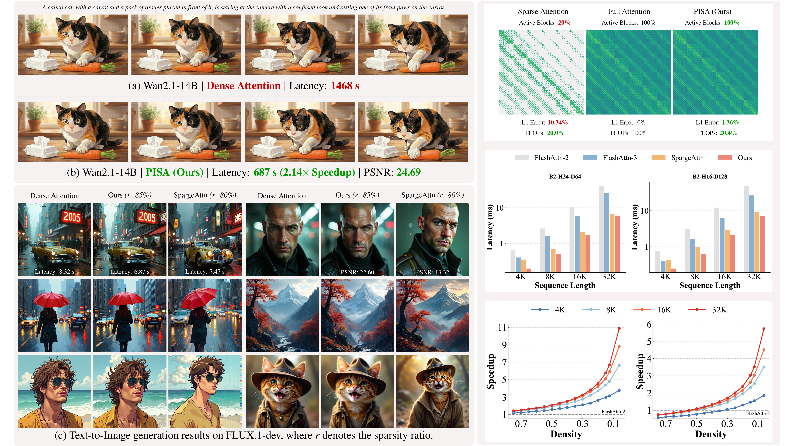

<div align ="center">
    <h2>
        PISA: Piecewise Sparse Attention Is Wiser for Efficient Diffusion Transformers
    </h2>
</div>

<!-- <p align="center">
    <a href="https://arxiv.org/abs/2602.01077"><b>Paper</b></a>
</p> -->

<p align="center">
    
<p>


## 🔥 News
- [2026/02] [Paper](https://arxiv.org/abs/2602.01077) is released.


## 💡 TL;DR
We propose a training-free Piecewise Sparse Attention (PISA) that covers the full attention span with sub-quadratic complexity.

Unlike the standard ***keep-or-drop*** paradigm that directly drop the non-critical blocks, PISA introduces a novel ***exact-or-approximate*** strategy: it maintains exact computation for critical blocks while efficiently approximating the remainder through block-wise Taylor expansion.


## ⏰ Plans
- [x] Release triton kernel
- [x] Release flux.1-dev inference demo
- [ ] Release wan/hyvideo inference script


## 🔧 Installation
Requirements:
* `torch >= 2.10`
* `triton >= 3.6`


Install:
```shell
git clone https://github.com/hp-l33/piecewise-sparse-attention.git
cd piecewise-sparse-attention
pip install -e .
```

Note: Our kernels are currently primarily optimized for the NVIDIA Hopper architecture (e.g., H100, H800).

### Kernel variants

| API | Description |
|:----|:------------|
| `piecewise_sparse_attention_hyd` | The version corresponding to the paper. |
| `piecewise_sparse_attention_0th` | A simplified zeroth-order version that supports training. |

## 🎮 Quick Start
### Text-to-Image Generation
```diff
from diffusers import AutoPipelineForText2Image
+ from piecewise_attn import piecewise_sparse_attention
+ from piecewise_attn.models import FluxAttnProcessor, set_processor

pipeline = AutoPipelineForText2Image.from_pretrained(
    "black-forest-labs/FLUX.1-dev", torch_dtype=torch.bfloat16,
).to("cuda")

+ pipeline = set_processor(pipeline, piecewise_sparse_attention, density=0.15)

prompt = "A portrait of a human growing colorful flowers from her hair. Hyperrealistic oil painting. Intricate details."
image = pipe(
    prompt,
    height=1024,
    width=1024,
    guidance_scale=3.5,
    num_inference_steps=50,
    max_sequence_length=512,
).images[0]
```

Use the explicit variant names when switching implementations:

```python
from piecewise_attn import (
    piecewise_sparse_attention_0th,
    piecewise_sparse_attention_hyd,
)

# Paper version (the existing piecewise_sparse_attention alias points here).
out_hyd = piecewise_sparse_attention_hyd(q, k, v, density=0.15)

# Simplified trainable version.
q, k, v = (tensor.requires_grad_() for tensor in (q, k, v))
out_0th = piecewise_sparse_attention_0th(q, k, v, density=0.15)
out_0th.float().square().mean().backward()
```

### Attention sink for MMDiT

Both variants accept `sink_idx=None`, `0`, or `-1`. Setting it to `0` or `-1` forces the first or last K/V block into the exact top-k branch for every query block. For example, when an MMDiT such as HunyuanVideo places text tokens in the last block:

```python
from piecewise_attn import piecewise_sparse_attention_0th

out = piecewise_sparse_attention_0th(
    q,
    k,
    v,
    density=0.1,
    block_size=64,
    sink_idx=-1,
)
```


## 🔗 BibTeX
If this work is helpful for your research, please give it a star or cite it:
```bibtex
@article{li2026pisa,
  title = {PISA: Piecewise Sparse Attention Is Wiser for Efficient Diffusion Transformers},
  author = {Li, Haopeng and Shao, Shitong and Zhong, Wenliang and Zhou, Zikai and Bai, Lichen and Xiong, Hui and Xie, Zeke},
  journal={arXiv preprint arXiv:2602.01077},
  year={2026}
}
```
